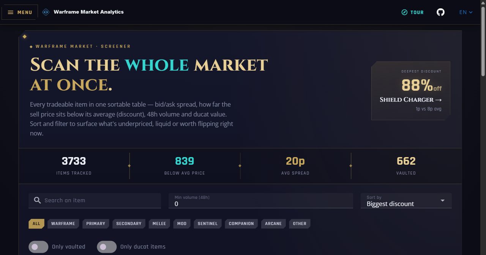
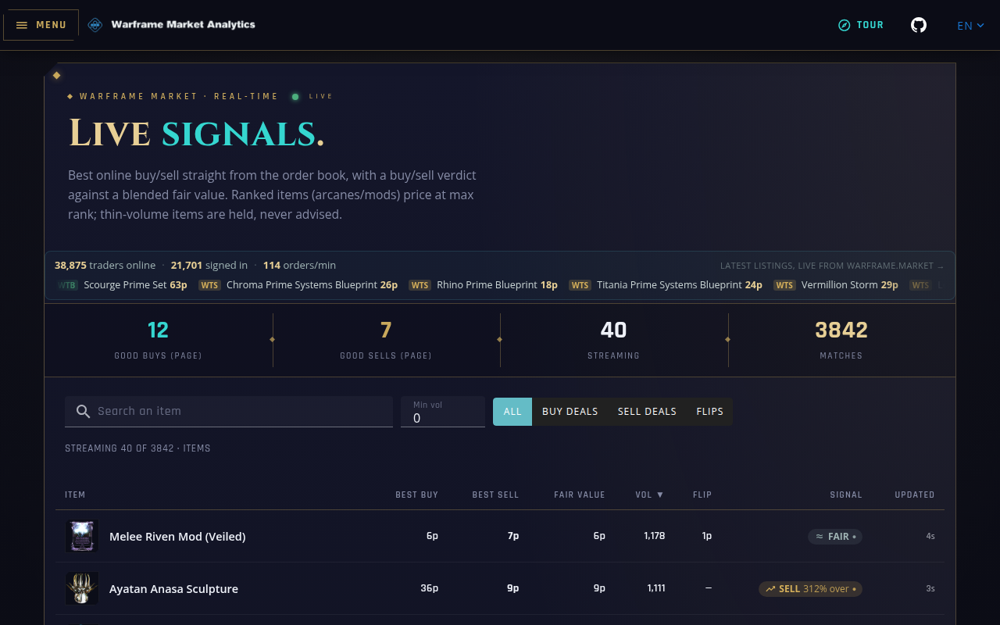
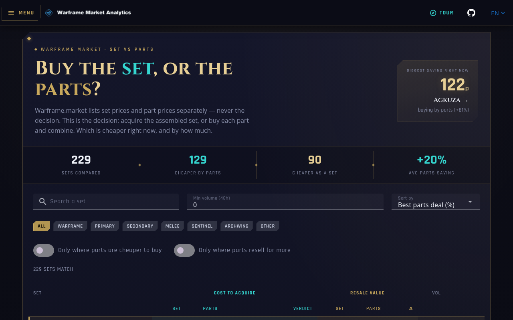
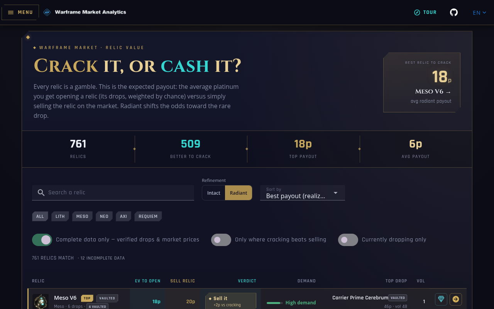
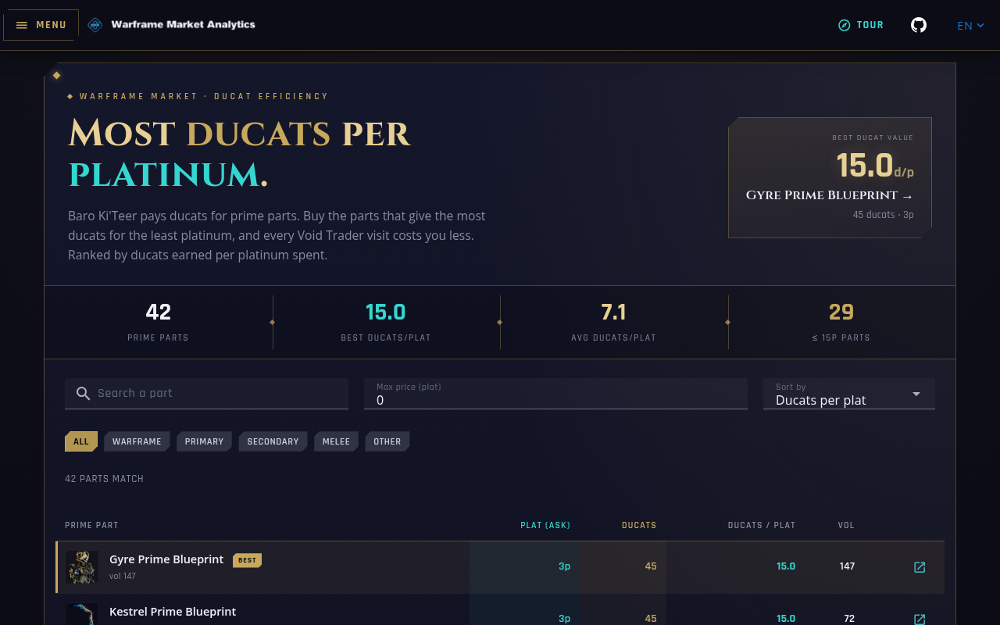
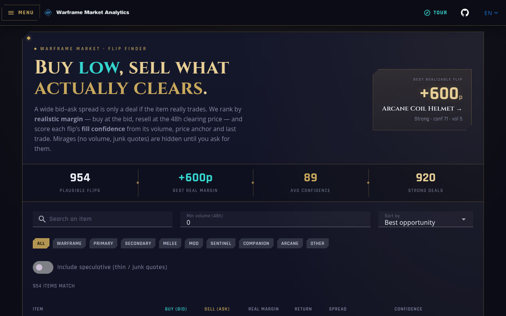
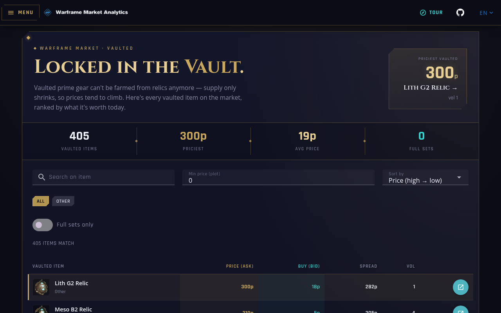
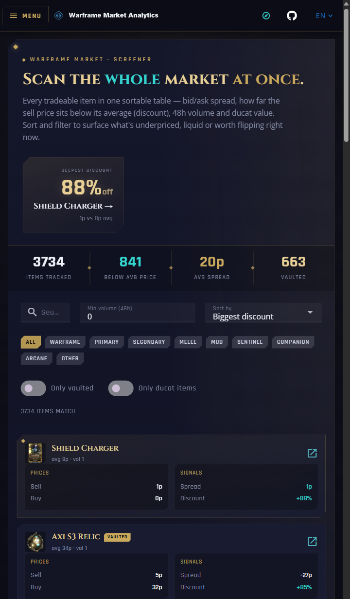

<div align="center">

# ◈ Warframe Market Analytics

**Scan the whole [Warframe.market](https://warframe.market) at once — spot underpriced prime parts, value your relics and rivens, and catch flips in real time.**

[](https://warframe-app.digitalshopuy.com)

[](https://nuxt.com)
[](https://vuetifyjs.com)
[](https://www.typescriptlang.org)
[](https://nodejs.org)
[](LICENSE)
[](CONTRIBUTING.md)

[](https://warframe-app.digitalshopuy.com)

*Free · No signup · Installable PWA · Open source · Not affiliated with Digital Extremes or Warframe.market*

</div>

---

## ◈ What this is (in plain terms)

Warframe.market is great for looking up **one** item at a time. This project flips that around: it continuously reads the **public** Warframe.market API, stores a daily price history, and turns it into screeners and tools that answer questions the official site can't at a glance —

> *Which prime sets are cheaper bought as parts? Which relics are worth cracking right now? What's my riven actually worth? What's a good flip this minute?*

It's an **independent, open-source fan project.** Everything it shows is derived from public market data. There is no account system, no ads, and no tracking — the code is right here for you to read, run, or self-host. See [**Transparency & Trust**](#-transparency--trust) for exactly how it sources data and handles privacy.

**Live app → [warframe-app.digitalshopuy.com](https://warframe-app.digitalshopuy.com)**

---

## ◈ The tools

| Tool | What it answers |
|------|-----------------|
| [**Market Screener**](https://warframe-app.digitalshopuy.com) | Every tradeable item in one sortable table — spread, discount vs. average, 48h volume, ducat value |
| [**Live Signals**](https://warframe-app.digitalshopuy.com/live) | Real-time order feed with buy / sell / flip verdicts as they hit the market |
| [**Set vs. Parts**](https://warframe-app.digitalshopuy.com/comparison) | Is a prime set cheaper assembled, or bought part-by-part? |
| [**Relic Value**](https://warframe-app.digitalshopuy.com/relics-value) | Expected platinum payout per relic (Intact / Radiant) |
| [**Ducat Efficiency**](https://warframe-app.digitalshopuy.com/ducats) | Best ducats-per-platinum parts for Baro Ki'Teer |
| [**Flip Finder**](https://warframe-app.digitalshopuy.com/flip) | The widest, most liquid buy/sell spreads |
| [**Riven Value**](https://warframe-app.digitalshopuy.com/riven-value) | Estimate a riven mod's platinum worth |
| [**Endo Farming**](https://warframe-app.digitalshopuy.com/endo) | Cheapest Endo-per-platinum riven listings |
| [**Vaulted**](https://warframe-app.digitalshopuy.com/vaulted) · [**Vault Spikes**](https://warframe-app.digitalshopuy.com/vault-spikes) | Track vaulted prime prices climbing in value |
| [**Portfolio**](https://warframe-app.digitalshopuy.com/portfolio) | Track items you hold + optional in-browser price alerts |

## ◈ A look inside

<table>
  <tr>
    <td width="50%" valign="top">
      <a href="https://warframe-app.digitalshopuy.com/live"></a>
      <p align="center"><strong>Live Signals</strong> — real-time buy / sell / flip verdicts</p>
    </td>
    <td width="50%" valign="top">
      <a href="https://warframe-app.digitalshopuy.com/comparison"></a>
      <p align="center"><strong>Set vs. Parts</strong> — cheaper assembled, or part-by-part?</p>
    </td>
  </tr>
  <tr>
    <td width="50%" valign="top">
      <a href="https://warframe-app.digitalshopuy.com/relics-value"></a>
      <p align="center"><strong>Relic Value</strong> — crack it, or sell it?</p>
    </td>
    <td width="50%" valign="top">
      <a href="https://warframe-app.digitalshopuy.com/ducats"></a>
      <p align="center"><strong>Ducat Efficiency</strong> — most ducats per platinum for Baro</p>
    </td>
  </tr>
  <tr>
    <td width="50%" valign="top">
      <a href="https://warframe-app.digitalshopuy.com/flip"></a>
      <p align="center"><strong>Flip Finder</strong> — realistic margins that actually clear</p>
    </td>
    <td width="50%" valign="top">
      <a href="https://warframe-app.digitalshopuy.com/vaulted"></a>
      <p align="center"><strong>Vaulted</strong> — vaulted primes ranked by what they're worth</p>
    </td>
  </tr>
</table>

<div align="center">
  
  <br>
  <em>Runs anywhere — it's an installable PWA, so it works like a native app on your phone.</em>
</div>

---

## ◈ Table of contents

- [What this is](#-what-this-is-in-plain-terms)
- [The tools](#-the-tools)
- [A look inside](#-a-look-inside)
- [Transparency & Trust](#-transparency--trust)
- [Features](#-features)
- [Tech stack](#-tech-stack)
- [Architecture](#-architecture)
- [Quick start](#-quick-start)
- [Full installation](#-full-installation)
- [Configuration](#-configuration)
- [Data synchronization](#-data-synchronization)
- [API reference](#-api-reference)
- [Deployment](#-deployment)
- [Troubleshooting](#-troubleshooting)
- [Contributing](#-contributing)
- [Support the project](#-support-the-project)
- [License & attribution](#-license--attribution)

---

## ◈ Transparency & Trust

Because this tool is built for the community, here's the full, honest picture of how it works. Nothing below is hidden in the code.

### Where the data comes from
- **100% from the public [Warframe.market API](https://warframe.market/api_docs)** and the community drop tables. No private endpoints, no logged-in scraping of other players, no in-game data extraction.
- Prices are **synced on a schedule** and cached, then served from our own database. The app builds a **daily price-history series** over time so it can show trends and discounts — a fresh deploy starts with an empty history and fills in as syncs run.
- Every number is an **estimate from public order books.** Markets move constantly — always confirm the live listing on Warframe.market before you trade.

### Your privacy
- **No account. No login. No email required.** You never hand us any credentials.
- **No ad networks, no third-party analytics selling your data.**
- Your **portfolio, alerts, and settings live in your own browser** (`localStorage`) — they're never uploaded to a server, and they don't sync across devices for exactly that reason.
- Price alerts fire as **local browser notifications** while a tab is open. There's no push server watching your account.

### The "anti-detection" / proxy system, explained honestly
The backend includes optional proxy rotation and request throttling (`anti-detection.ts`, [`ANTI_DETECTION_README.md`](ANTI_DETECTION_README.md)). To be transparent about what that is and isn't:
- Its **only** purpose is to keep our **own** scheduled syncs from being rate-limited (HTTP 403) by the upstream CDN while reading **public** endpoints. It reads the same data any visitor to Warframe.market can see.
- It is **not** used to attack, spam, log into, or overload Warframe.market, and it does **not** touch the game client. It runs on a conservative interval with caching so we hit the upstream API as little as possible.
- Proxies are **entirely optional** — set `PROXY_LESS=true` and the app runs direct. No proxy lists or keys ship in this repo.

### Not affiliated
- This is a **community fan project.** It is **not** affiliated with, endorsed by, or operated by **Digital Extremes** (Warframe) or **Warframe.market**. All game content and trademarks belong to Digital Extremes.

### It's yours to inspect
- **Fully open source (ISC).** Read every line, [self-host it](#-full-installation), fork it, or [open an issue](https://github.com/eduair94/warframe/issues). No secrets are required to run it — this repo ships **only** example templates and placeholders (see [`.env.example`](.env.example)).

---

## ◈ Features

- **Whole-market screener** — every tradeable item in one sortable, filterable table (spread, discount, 48h volume, ducats).
- **Real-time Live Signals** — Socket.IO order feed with buy / sell / flip verdicts and thin-market safety flags.
- **Relic, ducat & riven analytics** — expected relic payouts, ducat efficiency for Baro, and riven value/Endo estimates.
- **Daily price history & trend indicators** — one price point per item per day, charted on the item detail view.
- **Vault tracking** — surface vaulted primes whose prices are spiking.
- **Copy WTS/WTB** — generates the standard trade-chat shorthand to paste into the game manually.
- **In-browser portfolio & alerts** — track holdings and set sell-price thresholds, stored locally.
- **Full internationalization** — multi-language UI (EN/ES and more).
- **Installable PWA** — add to home screen; works offline-friendly and mobile-first.
- **Layered caching (Redis + edge)** so cold paths never stall the API.

---

## ◈ Tech stack

| Layer | Technology |
|-------|-----------|
| Frontend | **Nuxt 4**, **Vuetify 3**, TypeScript, PWA |
| Backend API | **Node.js**, **Express**, TypeScript |
| Real-time | **Socket.IO** live feed |
| Database | **MongoDB** (Mongoose) |
| Caching | **Redis** L2 + in-process L1 + Cloudflare edge |
| Data source | Public **Warframe.market API** + community drop tables |
| Process mgmt | **PM2** / Docker Compose |

---

## ◈ Architecture

```
warframe/
├── app/                # Nuxt 4 + Vuetify 3 frontend (PWA)
│   ├── app/            # pages, components, composables
│   ├── i18n/           # translations
│   └── public/img/     # logo + screenshots
├── Express/            # Express server wrapper (routing, caching, rate limits)
├── services/           # data/analytics services
├── constants/          # shared constants
├── proxies/            # (optional, git-ignored) proxy lists
├── server.ts           # API entry point — registers all routes
├── live.ts             # real-time Socket.IO feed process
├── warframe.ts         # Warframe.market API client
├── anti-detection.ts   # optional proxy rotation / throttling
├── database.ts         # MongoDB connection + models
└── sync_*.ts           # scheduled data-sync scripts
```

**Data flow:** `sync_*.ts` reads the public Warframe.market API → normalizes and stores it in MongoDB (building a daily price history) → `server.ts` serves cached JSON through Redis + Cloudflare → the Nuxt app renders the tools.

---

## ◈ Quick start

Prefer not to run anything? **Just use the [live app](https://warframe-app.digitalshopuy.com).** To run it yourself:

```bash
# 1. Clone
git clone https://github.com/eduair94/warframe
cd warframe

# 2. Install backend + frontend deps
npm run setup            # = npm install && cd app && npm install

# 3. Configure (only MONGODB_URI is strictly required)
cp .env.example .env     # edit MONGODB_URI; set PROXY_LESS=true to skip proxies

# 4. Seed the database (items first, then prices)
npm run sync_items
npm run sync_prices

# 5. Run — API + frontend in two terminals
npm run dev              # API  → http://localhost:3529
cd app && npm run dev    # web  → http://localhost:3312
```

> **Minimum to boot:** Node ≥ 20, a reachable MongoDB, and `PROXY_LESS=true`. Everything else (Redis, proxies, reCAPTCHA, the live feed) is optional and degrades gracefully.

---

## ◈ Full installation

### Prerequisites

| Requirement | Version | Notes |
|-------------|---------|-------|
| **Node.js** | ≥ 20 | [Download](https://nodejs.org/) — see `.nvmrc` |
| **MongoDB** | ≥ 4.4 | Local or [Atlas](https://www.mongodb.com/cloud/atlas) (free tier works) |
| **Redis** | optional | Enables the durable L2 cache; without it, in-process cache is used |
| **PM2** | optional | For production process management |

### 1 — Clone & install

```bash
git clone https://github.com/eduair94/warframe
cd warframe
npm install          # backend
cd app && npm install && cd ..   # frontend
```

### 2 — Configure the backend

```bash
cp .env.example .env
```

At minimum, set your MongoDB connection and (if you don't have proxies) disable them:

```env
MONGODB_URI=mongodb://localhost:27017/warframe
PROXY_LESS=true
API_PORT=3529
```

> 🔒 **Your `.env` holds your real config and must never be committed.** It's already in `.gitignore`. This repo intentionally contains **no** keys, proxies, or credentials — only `.env.example`.

### 3 — Configure the frontend

The Nuxt app in `app/` reads its own env for the API URL:

```env
# app/.env
API_URL=http://localhost:3529
BASE_URL=http://localhost:3312
```

### 4 — Set up MongoDB

**Local:**
```bash
# Windows:  net start MongoDB
# macOS:    brew services start mongodb-community
# Linux:    sudo systemctl start mongod
```

**Cloud:** create a free [Atlas](https://www.mongodb.com/cloud/atlas) cluster and paste its connection string into `MONGODB_URI`.

### 5 — Seed & run

```bash
npm run sync_items && npm run sync_prices   # seed
npm run dev                                 # API
cd app && npm run dev                       # frontend
```

---

## ◈ Configuration

Core environment variables (see [`.env.example`](.env.example) for the complete, commented list including Redis cache, cache warmer, and the live-feed process):

| Variable | Description | Default | Required |
|----------|-------------|---------|----------|
| `MONGODB_URI` | MongoDB connection string | `mongodb://localhost:27017/warframe` | ✅ |
| `API_PORT` | Backend API port | `3529` | — |
| `FRONTEND_PORT` | Frontend port | `3312` | — |
| `PROXY_LESS` | Disable proxy usage entirely | `false` | — |
| `PROXY_API_KEY` | ProxyScrape API key (only if using proxies) | — | — |
| `PROXY_TYPE` | Proxy type (`http` / `socks5`) | `http` | — |
| `REDIS_URL` | Redis L2 cache (optional; falls back to in-process) | — | — |
| `CACHE_TTL_SECONDS` | Fresh TTL for cached GET routes | `60` | — |
| `RECAPTCHA_SITE_KEY` / `RECAPTCHA_SECRET_KEY` | reCAPTCHA for protected POSTs (optional) | — | — |
| `ADMIN_SYNC_TOKEN` | Guards sync-triggering endpoints | — | — |
| `LIVE_FEED_MODE` | Live feed: `poller` / `socket` / `off` | `poller` | — |

---

## ◈ Data synchronization

The `sync_*` scripts pull public data into MongoDB. Run `sync_items` **first** (everything else references it):

```bash
npm run sync_items      # all Warframe items (run first)
npm run sync_prices     # current market prices → builds daily history
npm run sync_rivens     # riven mod auctions
npm run sync_auctions   # auction data
npm run sync_drops      # relic drop tables
```

**In production**, PM2 (`ecosystem.config.js`) schedules these — items daily, prices/auctions on a rolling basis. Price history and trend indicators only become meaningful after `sync_prices` has run for several days, since the series is built one day at a time from public data.

---

## ◈ API reference

The backend exposes a read-only JSON API (base path served from the API host). Responses are cached via Redis + edge.

| Method | Endpoint | Description |
|--------|----------|-------------|
| `GET` | `/` | All items with market data (screener payload) |
| `GET` | `/set/:url_name` | A specific item/set |
| `GET` | `/sets_comparison` | Set-vs-parts comparison data |
| `GET` | `/relics` | All relics |
| `GET` | `/relics_ev` | Relic expected-value payouts |
| `GET` | `/relic/:url_name` | A specific relic |
| `GET` | `/drops/map` · `/drops/item/:name` | Drop-table data |
| `GET` | `/rivens` · `/riven_weapons` · `/riven_value/:weapon` | Riven data & valuation |
| `GET` | `/endo_flip` | Endo-efficiency riven listings |
| `GET` | `/orders/:url_name` | Order book for an item |
| `GET` | `/price_history/:url_name` | Daily price history for an item |
| `GET` | `/market_analytics` | Aggregate market analytics |

> `build_relics` / `build_drops` trigger live DB writes and are rate-limited + guarded by `ADMIN_SYNC_TOKEN` when set.

---

## ◈ Deployment

### Docker Compose

Builds the backend, frontend, and a MongoDB container together. **`.env` must exist in the repo root first** — Compose reads it for port substitution and to pass config into the API container:

```bash
cp .env.example .env      # edit with real settings
npm run docker:run        # docker-compose up -d
npm run docker:stop       # docker-compose down
```

In Compose, the API connects to the `mongodb` service directly (`MONGODB_URI` is overridden to `mongodb://mongodb:27017/warframe`).

### PM2

```bash
npm run build && (cd app && npm run build)
pm2 start ecosystem.config.js
pm2 status && pm2 logs
```

---

## ◈ Troubleshooting

<details>
<summary><strong>Database connection errors</strong></summary>

Confirm MongoDB is running (`sudo systemctl status mongod` / `net start MongoDB`) and that `MONGODB_URI` is reachable from where the API runs.
</details>

<details>
<summary><strong>Port already in use</strong></summary>

```bash
npx kill-port 3529        # or change API_PORT / FRONTEND_PORT in .env
```
</details>

<details>
<summary><strong>403 / rate-limit errors during sync</strong></summary>

The upstream CDN is throttling. Either add proxy credentials, or slow your sync frequency. `PROXY_LESS=true` runs direct; heavy syncing without proxies may get rate-limited — that's expected, just back off.
</details>

<details>
<summary><strong>Memory issues on large syncs</strong></summary>

```bash
export NODE_OPTIONS="--max-old-space-size=4096"
```
</details>

<details>
<summary><strong>Enable debug logging</strong></summary>

Set `DEBUG=warframe:*` (or `DEBUG=true`) in `.env`.
</details>

---

## ◈ Contributing

Contributions are genuinely welcome — bug reports, translations, new tools, or fixes. See [**CONTRIBUTING.md**](CONTRIBUTING.md) for the full guide.

```bash
git checkout -b feature/my-improvement
# make changes; keep TypeScript + ESLint/Prettier happy
npm run lint && npm test
git commit -am "feat: describe your change"
git push origin feature/my-improvement   # then open a PR
```

Please also review [`SECURITY.md`](SECURITY.md) before submitting — and never commit real credentials, proxy lists, or `.env` files.

---

## ◈ Support the project

This is a free, no-ads, community project maintained on personal time. If it saves you platinum, a coffee is hugely appreciated (entirely optional — the tool stays 100% free either way):

[](https://ko-fi.com/cambio_uruguay)

The best free way to help: ⭐ **star the repo**, report bugs, and share it with your clan.

---

## ◈ License & attribution

- **License:** [ISC](LICENSE) — free to use, modify, and self-host.
- **Data:** public [Warframe.market API](https://warframe.market/api_docs) & community drop tables.
- **Built with:** [Nuxt](https://nuxt.com) · [Vuetify](https://vuetifyjs.com) · [Express](https://expressjs.com) · [MongoDB](https://www.mongodb.com) · [Socket.IO](https://socket.io).

> **Disclaimer:** Warframe Market Analytics is an independent, community-made fan project. It is **not affiliated with, endorsed by, or operated by Digital Extremes or Warframe.market.** *Warframe* and all related content are trademarks of Digital Extremes Ltd. All market figures are estimates from public data — always verify live listings before trading.

<div align="center">

**◈ Made by the community, for the Tenno. ◈**

[Live app](https://warframe-app.digitalshopuy.com) · [Report a bug](https://github.com/eduair94/warframe/issues) · [Contribute](CONTRIBUTING.md)

</div>
